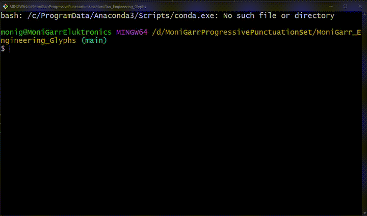
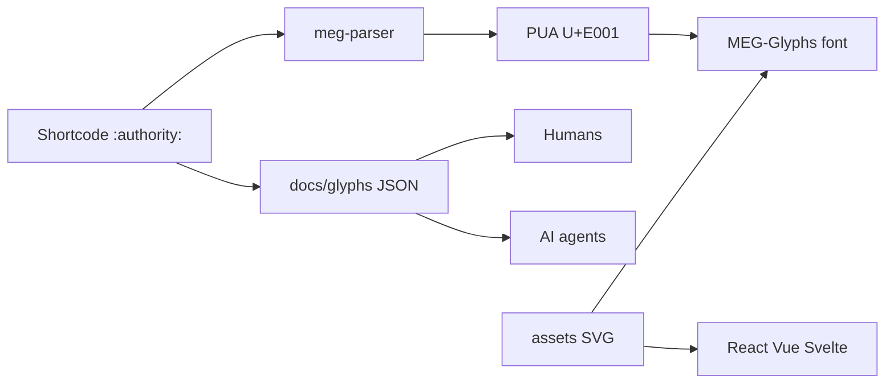
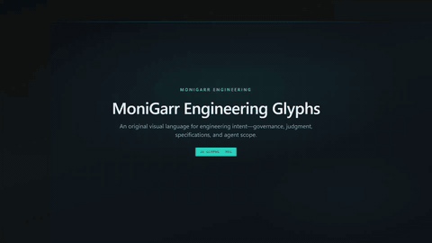

# MoniGarr Engineering Glyphs (MEG)

**Punctuation for engineering intent** — not grammar.

Write `:authority:` next to a trust boundary and both humans and AI agents treat that block as non-negotiable. Same idea for certitude, human gates, governance, and the rest of the catalog.

| You want to… | Go here |
|--------------|---------|
| Use shortcodes in docs / tickets today | [Use glyphs in 60 seconds](#use-glyphs-in-60-seconds) |
| Drop MEG into an app | [Add to your project](#add-to-your-project) |
| Clone and build this repo | [Develop in this repo](#develop-in-this-repo) |
| Know which glyph to pick | [Style guide](docs/style-guide.md) |
| Work here as an AI agent | [AGENTS.md](AGENTS.md) |

Deep onboard: [docs/getting-started.md](docs/getting-started.md) · Normative rules: [MEGS](docs/megs/README.md)

---

## Use glyphs in 60 seconds

Paste a shortcode in Markdown, ADRs, comments, or tickets:

```markdown
:authority:
Root trust policy — do not weaken these constraints in chat-driven refactors.

:human_judgement:
Production rollout needs an explicit human go/no-go.
```

| Shortcode | What it means (for you and for agents) |
|-----------|----------------------------------------|
| `:authority:` | Adjacent rules are immutable high-priority context |
| `:certitude:` | Logic is proven / fully evidenced — keep it deterministic |
| `:doubt_point:` | Claim is unverified — surface uncertainty |
| `:human_judgement:` | Stop; a human must decide |
| `:governance:` | Route through stated policy / review gates |
| `:specification:` | Prefer this text over chat-context guesses |
| `:explainability:` | Require auditable rationale |
| `:manicule:` | Prioritize the adjacent passage |

Full catalog (24): [style guide](docs/style-guide.md) · per-glyph AI metadata: [`docs/glyphs/`](docs/glyphs/)

**Rendering tip:** Shortcodes work as searchable text with no install. To see designed marks, install the **MEG-Glyphs** font and put `'MEG-Glyphs'` first in your editor / CSS `font-family`.

---

## Add to your project

```bash
pnpm add @monigarr/meg-parser @monigarr/meg-react
# also: @monigarr/meg-vue · @monigarr/meg-svelte · @monigarr/meg-font · @monigarr/meg-svg
```

**Parse shortcodes → Private Use Area characters**

```ts
import { replaceShortcodes, getGlyph } from "@monigarr/meg-parser";

replaceShortcodes("Respect :authority: boundaries.");
// → "Respect \uE001 boundaries."  (renders with MEG-Glyphs font)

getGlyph(":certitude:")?.codepoint; // "U+E002"
```

**React icons**

```tsx
import { AuthorityMark, CertitudePoint, MegIcon } from "@monigarr/meg-react";

<AuthorityMark size={24} />
<MegIcon name="human_judgement" title="Needs human judgement" />
```

Vue / Svelte: same pattern via `@monigarr/meg-vue` and `@monigarr/meg-svelte` (see each package README).

**Font / editor**

1. Get `MEG-Glyphs.ttf` from a [GitHub Release](.github/workflows/release-meg.yml) or `@monigarr/meg-font`.
2. Install system-wide (or import `@monigarr/meg-font/css` in a web app).
3. VS Code: Settings → Font Family → `'MEG-Glyphs', Consolas, monospace`.

Social posts usually ignore custom fonts — export PNGs when you need the designed shape off-repo.

---

## Develop in this repo

**Requirements:** Node 20+, pnpm 9+

```bash
pnpm install
pnpm run ci          # validate → build → test
```

[](assets/media/pnpm-install-build.mp4)

<sub>[Full MP4](assets/media/pnpm-install-build.mp4) · mute CLI walkthrough</sub>

| Command | When |
|---------|------|
| `pnpm validate` | Catalog / SVG / Unicode consistency |
| `pnpm build` | Optimize SVGs, fonts, maps, packages |
| `pnpm test` | Parser + map stability |
| `pnpm run ci` | Full gate (what GitHub Actions runs) |

| Change… | Edit… | Then |
|---------|-------|------|
| Artwork | `assets/<id>.svg` | `pnpm run ci` |
| Shortcode / PUA | `config/unicode-map.json` | `pnpm run ci` |
| Meanings / LLM instructions | `docs/glyphs/<id>.json` | Keep in sync with the style guide |

New glyph workflow: Cursor `/meg-new-glyph` or [CONTRIBUTING.md](CONTRIBUTING.md).

---

## How the pieces fit



| Layer | Role | Path |
|-------|------|------|
| Source art | Hand-authored SVGs | [`assets/`](assets/) |
| Identity | id → shortcodes → codepoint | [`config/unicode-map.json`](config/unicode-map.json) |
| Meaning | Visual / semantic / engineering / AI | [`docs/glyphs/`](docs/glyphs/) |
| Rules | MUST / SHOULD standards | [`docs/megs/`](docs/megs/) |
| Runtime | Packages & fonts | [`packages/`](packages/) |

---

## Catalog (24 glyphs)

[](assets/media/meg-glyph-catalog.mp4)

<sub>[Full MP4](assets/media/meg-glyph-catalog.mp4) · silent showcase of all 24 glyphs</sub>

Everyday starters above; complete table + usage notes in the [style guide](docs/style-guide.md).

---

## Packages

| Package | License | Purpose |
|---------|---------|---------|
| `@monigarr/meg-parser` | MIT | Shortcode → PUA |
| `@monigarr/meg-react` | MIT | Typed React components |
| `@monigarr/meg-vue` | MIT | Vue 3 components |
| `@monigarr/meg-svelte` | MIT | Svelte components |
| `@monigarr/meg-font` | OFL | TTF / WOFF2 / CSS |
| `@monigarr/meg-svg` | OFL | Optimized SVGs + `glyphs.json` |
| `packages/vscode-ext` | MIT (private) | Markdown autocomplete + hover |
| `packages/obsidian-plugin` | MIT (private) | Live Preview shortcode replace |

---

## Docs map

| Doc | Use when you need… |
|-----|-------------------|
| [Getting started](docs/getting-started.md) | Guided first session |
| [Style guide](docs/style-guide.md) | Which glyph / shortcode |
| [Glyph JSON](docs/glyphs/) | AI metadata & a11y strings |
| [MEGS](docs/megs/README.md) | Normative production rules |
| [CONTRIBUTING](CONTRIBUTING.md) | Adding glyphs / PRs |
| [AGENTS.md](AGENTS.md) | Agent hard laws & truth map |
| [CHANGELOG](CHANGELOG.md) | What changed |

---

## Release

1. Repo secret: `NPM_TOKEN`
2. `git tag vX.Y.Z && git push origin vX.Y.Z`
3. [release-meg.yml](.github/workflows/release-meg.yml) runs `pnpm run ci`, publishes `@monigarr/*`, attaches fonts

PR CI: [ci.yml](.github/workflows/ci.yml).

---

## Licensing

| Assets | License |
|--------|---------|
| Code, plugins, scripts | [MIT](LICENSE) |
| Fonts & SVG glyph shapes | [SIL OFL 1.1](OFL.txt) — RFN **MEG-Glyphs** |
| Documentation (`docs/`) | [CC BY 4.0](LICENSE-DOCS.md) |

---

## Philosophy

Engineering is communication. Specifications are contracts. Architecture is language. Governance enables innovation. Human judgment remains essential. AI amplifies expertise rather than replacing it. Trust is engineered. Quality compounds. Design communicates intent. Language shapes systems.
