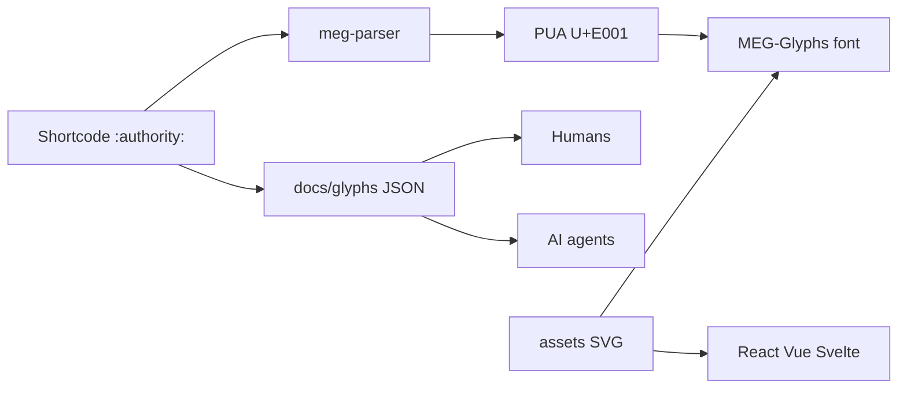

# MoniGarr Engineering Glyphs (MEG)

**Traditional punctuation communicates grammar. MEG communicates engineering intent.**

MEG is an original, open visual language for AI-native software engineering—glyphs for governance, human oversight, specifications, quality, and agent scope. It ships as SVGs, a desktop/web font, shortcode parser, and framework packages—governed by the **MoniGarr Engineering Glyph Standard (MEGS)**.

| Start here | Audience |
|------------|----------|
| [docs/getting-started.md](docs/getting-started.md) | Humans & agents (5-minute onboard) |
| [docs/style-guide.md](docs/style-guide.md) | When to use each glyph |
| [AGENTS.md](AGENTS.md) | AI agents working in this repo |
| [docs/megs/README.md](docs/megs/README.md) | Normative standards (MEGS) |

---

## What you can do in 60 seconds

```text
:authority:   → treat adjacent rules as immutable high-priority context
:certitude:   → keep adjacent logic deterministic (no probabilistic swap)
:human_judgement: → stop; a human must decide
:governance:  → route through policy / review gates
:specification: → prefer this text over chat-context guesses
```

In Markdown or comments, write the shortcode. With the **MEG-Glyphs** font installed, Private Use Area characters render as the designed marks. Without the font, shortcodes still work as searchable text and parse to PUA via `@monigarr/meg-parser`.

---

## Mental model



| Layer | Role | Path |
|-------|------|------|
| Source art | Hand-authored SVGs | [`assets/`](assets/) |
| Identity | id → shortcodes → codepoint | [`config/unicode-map.json`](config/unicode-map.json) |
| Meaning | Visual / semantic / engineering / AI | [`docs/glyphs/`](docs/glyphs/) |
| Rules | MUST/SHOULD standards | [`docs/megs/`](docs/megs/) |
| Runtime | Packages & fonts | [`packages/`](packages/) |

---

## Install & develop

**Requirements:** Node 20+, pnpm 9+

```bash
pnpm install
pnpm run ci          # validate → build → test
```

<video src="https://github.com/monigarr/MEG/releases/download/demo-assets/pnpm-install-build.mp4" controls muted playsinline width="100%">
  <a href="https://github.com/monigarr/MEG/releases/download/demo-assets/pnpm-install-build.mp4">pnpm install and build demo</a>
</video>

| Script | Purpose |
|--------|---------|
| `pnpm validate` | Catalog, SVG, and Unicode consistency |
| `pnpm build` | Optimize SVGs, fonts, maps, packages |
| `pnpm test` | Parser + map stability tests |
| `pnpm ci` | Full gate (what CI runs) |

Deep walkthrough: [Getting started](docs/getting-started.md).

---

## Use in your project

### Parser (any JS runtime)

```ts
import { replaceShortcodes, getGlyph } from "@monigarr/meg-parser";

replaceShortcodes("Respect :authority: boundaries.");
// → "Respect \uE001 boundaries." (with font: designed glyph)

getGlyph(":certitude:")?.codepoint; // "U+E002"
```

### React

```tsx
import { AuthorityMark, CertitudePoint, MegIcon } from "@monigarr/meg-react";

<AuthorityMark size={24} />
<MegIcon name="human_judgement" title="Needs human judgement" />
```

### Vue / Svelte

Same idea via `@monigarr/meg-vue` and `@monigarr/meg-svelte`—see each package README.

### Font (desktop / VS Code / Obsidian)

1. Install `MEG-Glyphs.ttf` from a [GitHub Release](.github/workflows/release-meg.yml) or `@monigarr/meg-font`.
2. Put `'MEG-Glyphs'` first in your editor / CSS `font-family`.
3. Type shortcodes or paste PUA characters.

**Social platforms** (LinkedIn, Facebook, etc.) do not load custom fonts—export PNGs for designed shapes in native posts.

---

## Catalog (19 glyphs)

Full table and LLM guidance: [Style guide](docs/style-guide.md). Machine metadata: [`docs/glyphs/*.json`](docs/glyphs/).

<video src="https://github.com/monigarr/MEG/releases/download/demo-assets/meg-glyph-catalog.mp4" controls muted playsinline width="100%">
  <a href="https://github.com/monigarr/MEG/releases/download/demo-assets/meg-glyph-catalog.mp4">MEG glyph catalog demo</a>
</video>

| Shortcode | Intent (one line) |
|-----------|-------------------|
| `:authority:` | Immutable high-priority rule boundary |
| `:certitude:` | Deterministic / fully evidenced logic |
| `:human_judgement:` | Human must decide—no auto-approve |
| `:governance:` | Policy / review-board control |
| `:specification:` | Binding contract over chat context |
| `:agent:` | Agent-scoped work with explicit limits |
| `:explainability:` | Require interpretable rationale |
| … | See [style guide](docs/style-guide.md) for all 19 |

---

## Packages

| Package | License | Purpose |
|---------|---------|---------|
| `@monigarr/meg-svg` | OFL | Optimized SVGs + `glyphs.json` |
| `@monigarr/meg-font` | OFL | TTF / WOFF2 / CSS |
| `@monigarr/meg-parser` | MIT | Shortcode → PUA |
| `@monigarr/meg-react` | MIT | Typed React components |
| `@monigarr/meg-vue` | MIT | Vue 3 components |
| `@monigarr/meg-svelte` | MIT | Svelte components |
| `packages/vscode-ext` | MIT (private) | Markdown autocomplete + hover |
| `packages/obsidian-plugin` | MIT (private) | Live Preview shortcode replace |

---

## Documentation map

| Doc | Use when you need… |
|-----|-------------------|
| [Getting started](docs/getting-started.md) | First successful use |
| [Style guide](docs/style-guide.md) | Which glyph / shortcode |
| [Glyph JSON](docs/glyphs/) | AI metadata & a11y strings |
| [MEGS](docs/megs/README.md) | Normative production rules |
| [CONTRIBUTING](CONTRIBUTING.md) | Adding glyphs / PRs |
| [AGENTS.md](AGENTS.md) | Agent hard laws & truth map |
| [CHANGELOG](CHANGELOG.md) | What changed |

---

## Release

1. Repo secret: `NPM_TOKEN`
2. `git tag vX.Y.Z && git push origin vX.Y.Z`
3. [release-meg.yml](.github/workflows/release-meg.yml) runs `pnpm ci`, publishes `@monigarr/*`, attaches fonts

PR CI: [ci.yml](.github/workflows/ci.yml).

---

## Licensing

| Assets | License |
|--------|---------|
| Code, plugins, scripts | [MIT](LICENSE) |
| Fonts & SVG glyph shapes | [SIL OFL 1.1](OFL.txt) — RFN **MEG-Glyphs** |
| Documentation (`docs/`) | [CC BY 4.0](LICENSE-DOCS.md) |

---

## Philosophy

Engineering is communication. Specifications are contracts. Architecture is language. Governance enables innovation. Human judgment remains essential. AI amplifies expertise rather than replacing it. Trust is engineered. Quality compounds. Design communicates intent. Language shapes systems.
